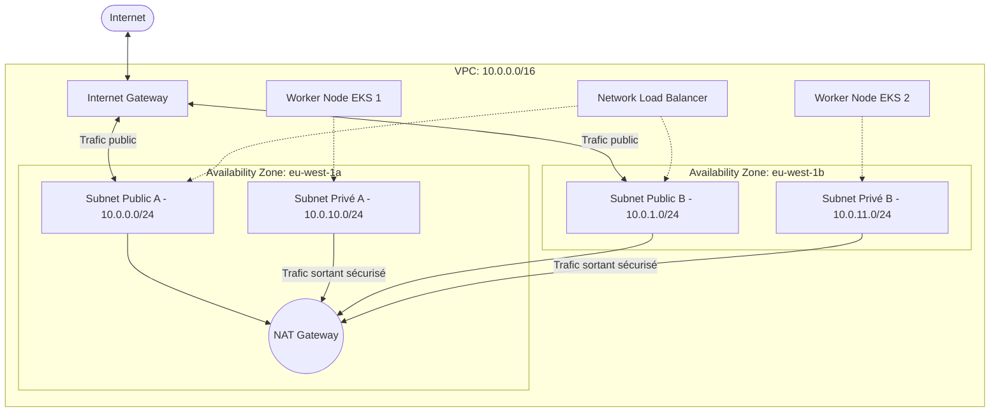
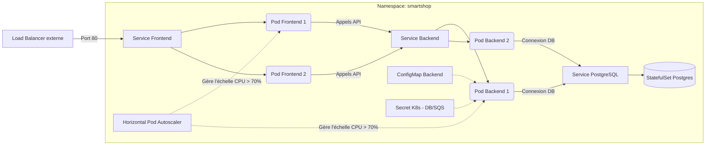
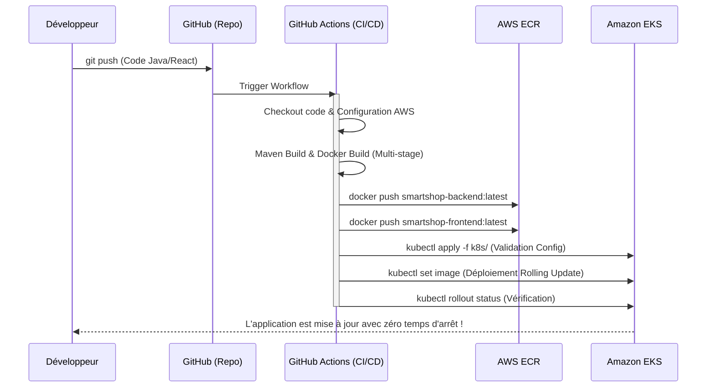

# 🎓 PFE : DevOps & Cloud AWS - SmartShop 🛒☁️

**Projet de Fin d'Études : Automatisation, Conteneurisation et Orchestration Cloud**

Ce dépôt contient l'intégralité du code as-code (IaC), de la configuration Kubernetes (GitOps), du pipeline CI/CD, et de l'architecture serveur pour l'application **SmartShop** (Spring Boot Backend + React Frontend). Le projet démontre une compréhension approfondie de l'architecture AWS, de l'orchestration de conteneurs, et des principes DevOps modernes.

---

## 🏗️ 1. Schéma d'Architecture AWS Globale
L'application est déployée sur Amazon Web Services de manière hautement disponible, résiliente et sécurisée.


> *Note : Un diagramme de type organigramme classique est également fourni ci-dessous pour plus de détails.*

```mermaid
graph TD
    User([Utilisateur / Client]) --> |HTTP/HTTPS| ALB[AWS Network Load Balancer]
    
    subgraph "AWS Cloud (eu-west-1)"
        ALB --> EKS[Cluster Amazon EKS]
        
        subgraph "Amazon EKS Cluster"
            Frontend[Pods Frontend React]
            Backend[Pods Backend Spring Boot]
            DB[(Pods PostgreSQL)]
            FluentBit[DaemonSet Fluent Bit]
            
            Frontend --> |API REST| Backend
            Backend --> |JDBC| DB
        end
        
        Backend --> |Envoi de messages asynchrones| SQS[File SQS principale]
        SQS --> |Traite les messages| BackendWorker[Worker Backend]
        SQS -.-> |Echec (Retry x3)| DLQ[Dead Letter Queue SQS]
        
        FluentBit --> |Transmission automatique des logs| CloudWatch[Logs CloudWatch]
        EKS --> |Métriques CPU/Mem| CWMetrics[CloudWatch Dashboard & Alarmes]
        
        ECR[Amazon ECR Registries] -.-> |Tire les images| EKS
    end
```

---

## 🔒 2. Schéma Réseau (VPC, Subnets, Sécurité)
Implémentation stricte des recommandations de sécurité réseau AWS avec séparation Public/Privé.


**Choix techniques :**
- Les nœuds EKS (Worker Nodes) et la base de données ne sont jamais exposés sur Internet, empêchant toute attaque externe directe.
- Le NAT Gateway permet aux nœuds privés de télécharger des mises à jour ou de communiquer avec ECR.

---

## ☸️ 3. Schéma Kubernetes (Pods, Services, HPA)
Gestion complète du cycle de vie des applications via Kubernetes (Helm/Manifests natifs).


**Choix techniques :**
- L'auto-scaling Horizontal (HPA) garantit une disponibilité continue (2 à 5 répliques), se déclenchant à 70% d'utilisation CPU.
- Les secrets (DB Password, SQS URL) sont encodés en Base64 et montés de manière sécurisée en tant que variables d'environnement.

---

## 🚀 4. Schéma et Pipeline CI/CD (GitHub Actions)
Chaque commit déclenche un pipeline asynchrone validant et déployant le nouveau code.



## 🛠️ Choix Techniques et Résumé
- **Infrastructure as Code (Terraform) :** Modulaire, reproductible et state géré via S3/DynamoDB pour permettre la collaboration.
- **Monitoring (Observabilité) :** Fluent Bit (DaemonSet) capture tous les `/var/log/containers` et les achemine vers CloudWatch Logs via IRSA. Des alarmes CloudWatch sont définies pour envoyer des alertes si les clusters K8s saturent.
- **Traitement Asynchrone (SQS) :** Le service de facturation Backend délègue le traitement long des données à Amazon SQS via `spring-cloud-aws-starter-sqs` (`@SqsListener`), déchargeant ainsi la charge API synchrone (Pattern Pub/Sub).

---

## 🌟 5. BONUS : Déploiement Canary (Partie 6 Bonus)
Pour valider l'exigence bonus de déploiement avancé, une stratégie de **Déploiement Canary** native à Kubernetes a été modélisée dans `k8s/08-bonus-canary.yaml`.
- **Principe :** Déployer une réplique de la nouvelle version de l'API Backend `track: canary` tout en garantissant qu'elle partage le même *Selector* (`app: smartshop-backend`) que la version de production.
- **Résultat :** Le Service Kubernetes native (ClusterIP) effectue automatiquement un équilibrage de charge "Round Robin", distribuant par exemple 25% du trafic à la version Canary et 75% à la version Stable, permettant de tester les nouvelles fonctionnalités sans risquer l'expérience utilisateur globale !
